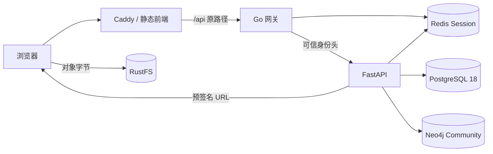

# 架构导览

本仓库是单仓库工作台，首版可演示登录、企业检索、画像、关系图谱、评分与企业文件上传/下载。

| 主题 | 文档 |
| --- | --- |
| Python 分层、迁移与种子 | [后端](backend.md) |
| FSD、SDK 与页面边界 | [前端](frontend.md) |
| DTO、信封与错误处理 | [API 与错误](api-errors.md) |
| Compose、Session 与对象存储 | [基础设施](infrastructure.md) |
| 命令与验收 | [本地开发](local-development.md) |
| SMEsD 模型与只读测试包 | [公开基准](benchmark.md) |

原工作台评分和解释由种子快照提供；报告、决策、模型看板和批量评估仍是前端演示。独立 `/benchmark` 使用保存的真实模型权重推理匿名测试样本，不与工作台企业数据合并。文件字节经预签名 URL 直连对象存储，业务 API 负责授权和元数据。

- [模型产物约定](model-artifacts.md)：独立开发环境、Release 包、挂载和升级。
