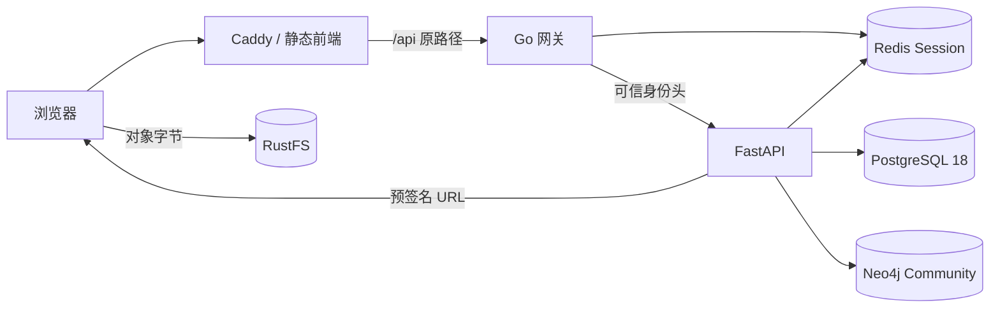

# 架构导览

本仓库是单仓库工作台，首版可演示登录、企业检索、画像、关系图谱、评分与企业文件上传/下载。

```mermaid
flowchart LR
  Browser[浏览器] --> Caddy[Caddy / 静态前端]
  Caddy -->|/api 原路径| Gateway[Go 网关]
  Gateway -->|可信身份头| API[FastAPI]
  Gateway --> Redis[(Redis Session)]
  API --> Redis
  API --> PG[(PostgreSQL 18)]
  API --> Neo4j[(Neo4j Community)]
  API -->|预签名 URL| Browser
  Browser -->|对象字节| RustFS[(RustFS)]
```

| 主题 | 文档 |
| --- | --- |
| Python 分层、迁移与种子 | [后端](backend.md) |
| FSD、SDK 与页面边界 | [前端](frontend.md) |
| DTO、信封与错误处理 | [API 与错误](api-errors.md) |
| Compose、Session 与对象存储 | [基础设施](infrastructure.md) |
| 命令与验收 | [本地开发](local-development.md) |
| SMEsD 模型与只读测试包 | [公开基准](benchmark.md) |
| Bundle 分析、异步训练与模型对比 | [模型实验工作台](modeling-workbench.md) |
| 建模术语、不变量与适配边界 | [建模领域模型](modeling-domain.md) |
| 新加坡企业聚合与调试样本 | [新加坡企业概览](singapore-overview.md) |
| SMEsD 边置信度受控实验协议 | [边置信度实验](smesd-edge-confidence-experiment.md) |
| ComRisk 家族边置信度通道证据 | [置信度通道证据](comrisk-confidence-channel-evidence.md) |
| ComRisk 家族数据、特征与规模证据 | [数据与规模证据](comrisk-data-and-scale-evidence.md) |
| 建图分层与超图/事件节点取舍 | [建图设计](graph-construction-design.md) |
| 关系强度/置信度拆分与传播设计 | [关系不确定性设计](relation-uncertainty-design.md) |
| 数据集训练配置与制品边界 | [训练配置档案](training-profile.md) |
| 模型开发环境、Release 包与挂载 | [模型产物约定](model-artifacts.md) |

原工作台评分和解释由种子快照提供；报告、决策、模型看板和批量评估仍是前端演示。`/overview` 使用新加坡导出包的真实全量聚合与 300 条固定调试样本，不生成信用分或 PD。独立 `/benchmark` 使用保存的真实模型权重推理匿名测试样本，不与工作台企业数据合并。`/modeling` 对标准 ZIP Bundle 做真实分析，并由本地 Worker 异步运行表格、图统计和 GNN 对照实验。文件字节经预签名 URL 直连对象存储，业务 API 负责授权和元数据。
