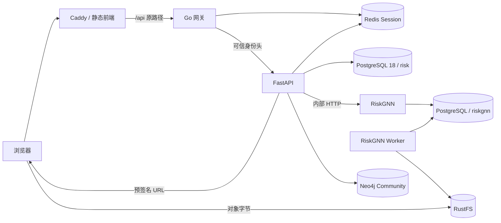

# 架构导览

本仓库是单仓库工作台，首版可演示登录、企业检索、画像、关系图谱、评分与企业文件上传/下载。

```mermaid
flowchart LR
  Browser[浏览器] --> Caddy[Caddy / 静态前端]
  Caddy -->|/api 原路径| Gateway[Go 网关]
  Gateway -->|可信身份头| API[FastAPI]
  Gateway --> Redis[(Redis Session)]
  API --> Redis
  API --> PG[(PostgreSQL 18 / risk)]
  API -->|内部 HTTP| Model[RiskGNN]
  Model --> ModelDB[(PostgreSQL / riskgnn)]
  Worker[RiskGNN Worker] --> ModelDB
  Worker --> RustFS
  API --> Neo4j[(Neo4j Community)]
  API -->|预签名 URL| Browser
  Browser -->|对象字节| RustFS[(RustFS)]
```

| 主题 | 文档 |
| --- | --- |
| Python 分层、迁移与种子 | [后端](backend.md) |
| FSD、SDK 与页面边界 | [前端](frontend.md) |
| DTO、信封与错误处理 | [API 与错误](api-errors.md) |
| Compose、Session 与对象存储 | [基础设施](infrastructure.md) |
| 命令与验收 | [本地开发](local-development.md) |
| 旧模型迁移与停用 | [迁移说明](modeling-migration.md) |
| 数据集、实验、独立测试与发布 | [模型实验工作台](modeling-workbench.md) |
| 建模术语、不变量与适配边界 | [建模领域模型](modeling-domain.md) |
| 新加坡企业聚合与调试样本 | [新加坡企业概览](singapore-overview.md) |

原工作台评分和解释仍为演示；新加坡概览为固定统计，独立模型工作台执行真实子集训练。

- [执行与恢复](modeling-execution.md)：Outbox、租约、取消、Attempt 和事件。
- [训练协议](training-profile.md)：完整 ZIP 校验、特征边界与固定子集。
- [模型产物](model-artifacts.md)：封存、独立加载、发布与下载。

## 研究与后续设计

- [企业关系建图](graph-construction-design.md)与[关系不确定性](relation-uncertainty-design.md)
- [数据与规模证据](comrisk-data-and-scale-evidence.md)、[置信度证据](comrisk-confidence-channel-evidence.md)
- [SMEsD 受控实验](smesd-edge-confidence-experiment.md)
- [RiskGNN+ 研究文稿](riskgnn_plus_paper.md)，与当前服务开放能力分开验收
