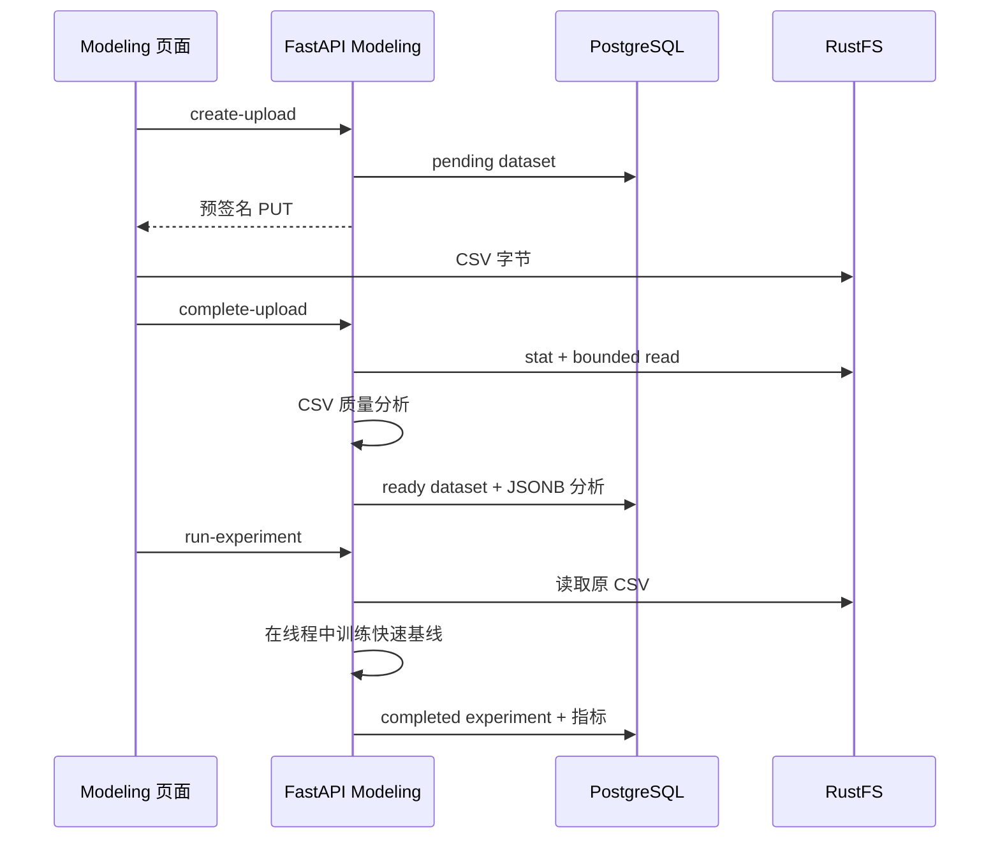

# 模型实验工作台

模型实验工作台是面向赛题数据探索的真实计算链路，不替代只读 SMEsD 基准，也不把快速基线描述为生产模型。入口为前端 `/modeling`，后端接口前缀为 `/api/v1/modeling`。

## 首版能力

1. 浏览器通过 60 秒预签名 URL 将 UTF-8 CSV 直传 RustFS。
2. 后端确认对象存在且尺寸一致后，解析最多 5 MB、2 万行、100 列的数据。
3. 数据质量报告包含行列数、缺失、重复、字段类型、唯一值、样例、数值统计、二分类目标候选和前 8 行预览。
4. 用户选择一个二分类目标、风险正类和最多 20 个数值字段。
5. 后端以固定随机种子完成分层 80/20 留出、训练集内中位数填补和标准化，并用 Torch 训练逻辑回归。
6. 实验保存 ROC-AUC、PR-AUC、KS、Brier、Precision、Recall、F1、混淆矩阵、校准分箱和标准化系数。

## 组件与数据流

后端 `modules/modeling` 仍按 `api → service → repository/model` 分层。HTTP DTO 只存在于 `api/schemas.py`；Service 接收业务参数并处理对象存储和计算，Repository 只负责 SQLAlchemy 读写。数据集和实验查询始终附带当前 Session 的 `owner_id`。

前端按 FSD 放置：`entities/modeling` 封装生成 DTO 与请求，`features/modeling` 管理上传、分析和训练状态，`pages/modeling` 组合页面专属面板。生成契约仍来自 `contracts/openapi.json`，不得手改 `shared/api/generated/schema.ts`。

## 评估口径与限制

- 这是固定 seed 的快速分层随机留出，只回答“字段是否具有初步预测信号”，不回答跨时间稳定性。
- 填补和标准化参数只从训练集计算，避免最直接的数据泄漏；仍需人工排查标签派生字段、未来信息和主体穿越。
- 当前只支持数值特征与二分类。类别编码、时间切分、交叉验证、不平衡学习、图构建、Gated-SAGE 与超图训练应作为后续独立实验类型接入。
- 训练通过 `asyncio.to_thread` 执行，并由文件、行列和特征上限约束。长任务、多用户并发或 GNN 训练必须迁移到任务队列/worker，而不是继续扩展请求线程。
- 保存的指标是该次上传数据的实验结果；它与 SMEsD 公共基准、前端演示评分及正式竞赛成绩相互独立。

## 扩展顺序

取得赛题字段后，先新增字段角色映射与标签时点校验，再实现类别特征编码和时间外评估。确认存在企业关系表后，新增图数据集/关系映射实体和异步构图任务，最后把表格基线、图传播特征与 GNN 作为并列实验类型比较，而不是直接替换当前可复现基线。
