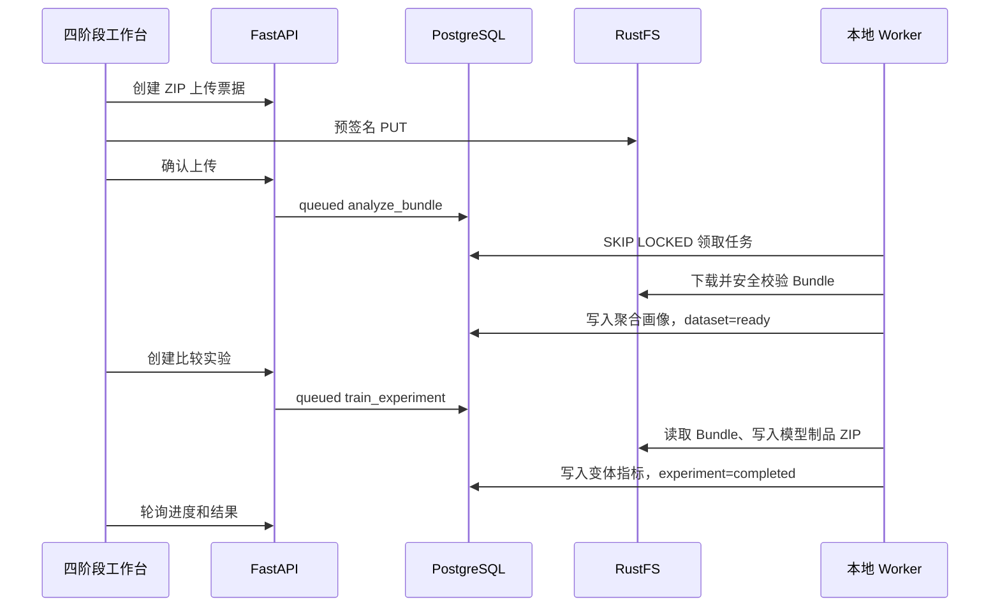

# 元数据驱动风险建模工作台

`/modeling` 是用户数据的真实离线实验链路，与产品演示评分和 `/benchmark` SMEsD
公开基准互相隔离。它不发布模型、不接生产授信，也不会把企业经营风险称为贷款违约概率。

## 输入契约

系统只接收 ZIP Bundle v1，不提供字段映射。外部适配脚本负责把原始申请、还款、征信、
工商及关系数据转换为：

```text
metadata.json                 必需
samples.csv|parquet           必需
nodes.csv|parquet             可选
relations.csv|parquet         可选
events.csv|parquet            可选
hyperedges.csv|parquet        可选
```

`samples` 是唯一训练入口，一行是一笔贷款申请或一个企业观察时点。每行固定包含
`sample_id`、`entity_id`、`observation_time`、`graph_snapshot_id`、`split`、`target`，
其余训练字段必须在 metadata 中声明类型和 `application`、`bureau`、`financial`、
`registry` 等特征组。metadata 同时声明任务语义、正类、预测窗口、文件大小与 SHA-256。

图组件使用外部生成的 `graph_snapshot_id`。Worker 校验节点与端点引用、样本实体和事件时间；
没有合法图快照时只允许表格模型。静态实验图会显示“不支持严格未来预测”的提示。

## 异步数据流



PostgreSQL只保存清单、聚合画像、状态与指标；不保存或返回客户原始行。ZIP 校验拒绝路径穿越、
符号链接、加密包、重复文件、哈希错误及超限压缩。任务采用租约，过期可恢复，最多执行三次。

## 分析与模型阶梯

分析阶段输出字段质量、标签/划分分布、单变量信号、相关性、PSI、泄漏提示，以及图节点、关系、
度、孤立样本、连通分量和超边画像。推荐特征只在 train 划分计算；填补、缩放、类别词表和选择
规则随实验制品保存。

可用能力决定模型阶梯：

1. `logistic_regression`：可解释线性基线；
2. `hist_gradient_boosting`：非线性表格基线；
3. `graph_stats_hgb`：加入训练安全的度、关系、邻居和超边统计；
4. `gnn_self_only`：样本、节点与事件编码，不传播关系；
5. `gnn_no_hyper`：门控异构关系传播；
6. `gnn_full`：增加可学习超边传播和门控融合。

GNN 使用事件类别 Embedding、数值投影、时间衰减、关系类型和正边权，按验证集 BCE 早停。
所有变体报告 ROC-AUC、PR-AUC、KS、Brier、Precision、Recall、F1、混淆矩阵和校准分箱。
制品保存在 RustFS，`manifest.json` 对每个模型文件记录大小和 SHA-256，`autoPublished=false`。

## 本地命令

模型工程内生成两种可验收样例：

```bash
cd com_risk_model
uv run python -m workbench.demo --output runs/loan.zip --task loan_application --with-graph
uv run python -m workbench.demo --output runs/entity.zip --task entity_snapshot --with-graph
uv run python -m workbench.worker          # 连续领取任务
uv run python -m workbench.worker --once   # 最多领取一个任务
```

完整开发拓扑、环境变量和端到端步骤见[本地开发](local-development.md)，领域口径见
[建模领域模型](modeling-domain.md)。
