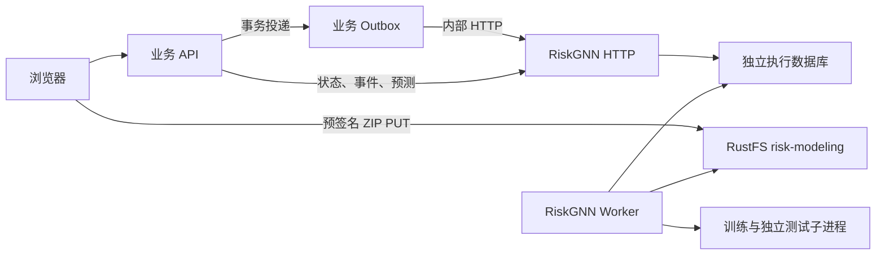

# 模型工作台

`/modeling` 分为数据集、实验、模型版本三个入口。

## 用户链路

1. ZIP 本地预览只列目录，上传进度来自浏览器实际字节传输。
2. 完成上传只代表对象就绪；后台全量校验通过后才能创建实验。
3. Run 固定 smoke-v1 协议，可设 1–20 轮，默认 2；展示阶段、曲线、Attempt 和诊断日志。
4. 可取消或在终态重新运行；URL 保存选中记录，刷新后继续轮询。
5. 独立测试成功才允许发布；模型版本可下载并预测最多 32 个图内企业。

原演示企业、报告、评分、文件链路保持独立；新加坡静态概览不显示本工作台的训练结果。
旧 /benchmark 链接进入停用说明；旧 Bundle 提交接口不再存在。

## API 与生成类型

业务前缀 `/api/v1/modeling/`，均为 POST：

| 资源 | 操作 |
| --- | --- |
| 数据集 | create-upload、complete-upload、get-dataset、list-datasets |
| 实验 | create-run、get-run、list-runs、cancel-run、rerun、run-events |
| 模型 | publish-model、get-model、list-models、download-model、predict-model |

业务契约来自 `contracts/openapi.json`；内部模型服务契约为 `contracts/riskgnn-openapi.json`。
后端 ModelClient 只依赖 HTTP 契约；前端从业务 OpenAPI 生成 DTO。
公共分页、四字段信封、Origin、Session 和请求 ID 约定继续有效。
模型服务不可用返回 503；资源跨用户访问返回 404；错误状态转换返回 409。

更多：[执行与恢复](modeling-execution.md)、[训练协议](training-profile.md)、[模型包](model-artifacts.md)。

## 统一模型服务与分析

代码位于 `models/service/`，与 baseline / riskgnn / riskgnn+ 并列。
HTTP 与 Worker 保持同一镜像；业务后端只负责归属、实验与可靠投递。
模型能力目录通过 POST `/api/v1/modeling/capabilities` 提供，已验收的模型配置才可提交。
当前训练选择 `riskgnn-node-edge` 或 `riskgnn-node-only`；两者共用固定真实子集协议。
Bundle v1 可上传、校验与分析，尚无匹配的可发布训练 runner；页面明确显示分析模式。
已停用的旧 Bundle 训练记录与对象保留，不把旧 worker 或旧模型网络复制成第二套实现。
数据集详情包含类型化分析报告；实验详情包含可追溯档案，均随 OpenAPI 生成前端类型。
旧已完成记录可能没有新分析字段，不伪造报告；重新上传可生成新版分析。
